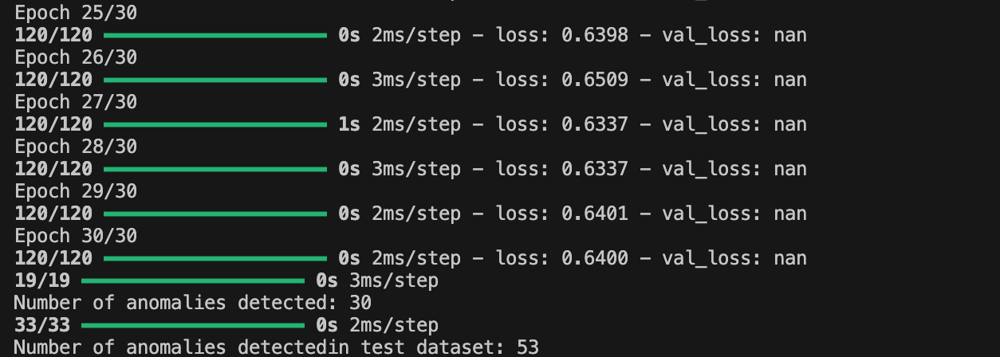
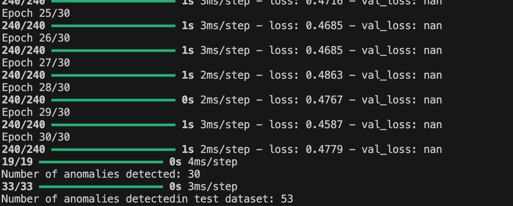
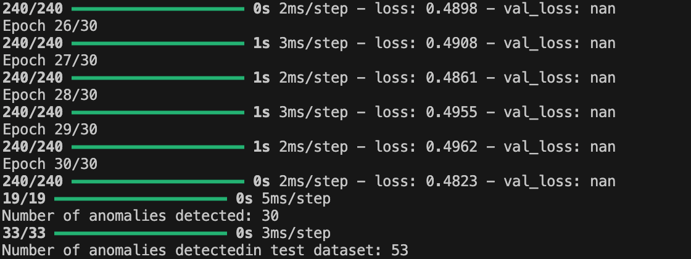
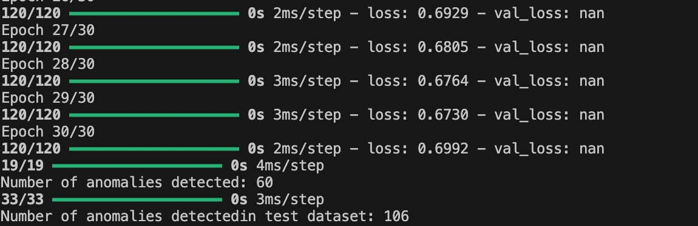
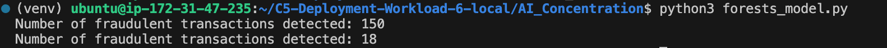

# Fraud Detection in E-Commerce Transactions: A DevOps Team's Approach to ML Integration

## Business Scenario

The e-commerce DevOps team is exploring the implementation of a machine learning model to provide automatic insights into identifying fraudulent transactions on the platform. With an increasing number of transactions, detecting anomalies manually has become inefficient. The team is considering three models for anomaly detection:

- **Isolation Forests**: A tree-based model that isolates anomalies efficiently.
- **Clustering with DBSCAN**: A density-based clustering approach that identifies regions of high density and isolates points in sparse regions as anomalies.
- **Autoencoders**: Neural networks designed to reconstruct input data, where anomalies result in higher reconstruction errors.

The goal is to evaluate these models, compare their performance, and decide on the most effective approach to integrate into the application.  

## Instructions

### Steps 
1. Deploy the application to the target production env.

- **Model Selection**  
   1. By looking our dataset, we don't have label for the data; therefore, we need to use unsupervised machine learning model.
   2. Comparing these three given models, the isolation forests model is better for the large dataset. Clustering with DBSCAN may not perform well for that. 
   3. I selected autiencoder model to train because it have the ablity to learn features using deep neural network.  

- **Tuning and Testing**  
   1. I've tuning the model by adjusting the number of neurons in each layer and also decrease the batch size and the learning rate. Theratically, it can improve the accuracy of detection or feature learning. However, in this case, the improvment is not obvious. 
   

   2. I've also investigated the features in the dataset. The arttributes for example the occurance of "card_number" also can reflect the fraud in some sense. I decide not to drop that column, but transfer it to the count. By adding more features to the data, the loss decrease. As shown below. From 0.64 to 0.47. However, the anomalies detection does not change. The loss is a metric for the model, but for each instance, it may not reflect that improvement. 
   
   3. I've then try to add another feature is 'name_on_card" to investgated how this feature affect the detection. It made the loss increase, so I dropped it. 
    
   4. I've also try to look into the threshold for reconstructions error, it turns out if I reduce the threshold, more transactions will be identified as anomalies. 95th is a reasonable threshold. 
         

- **Results**  

   Apply the autoencoder-model to the test dataset, I've got 53 fraud detection. 
      
The result for the isolate forest model
   
- **Integration into Application UI**  
   Propose how this model could be integrated into the current application UI for admins.
