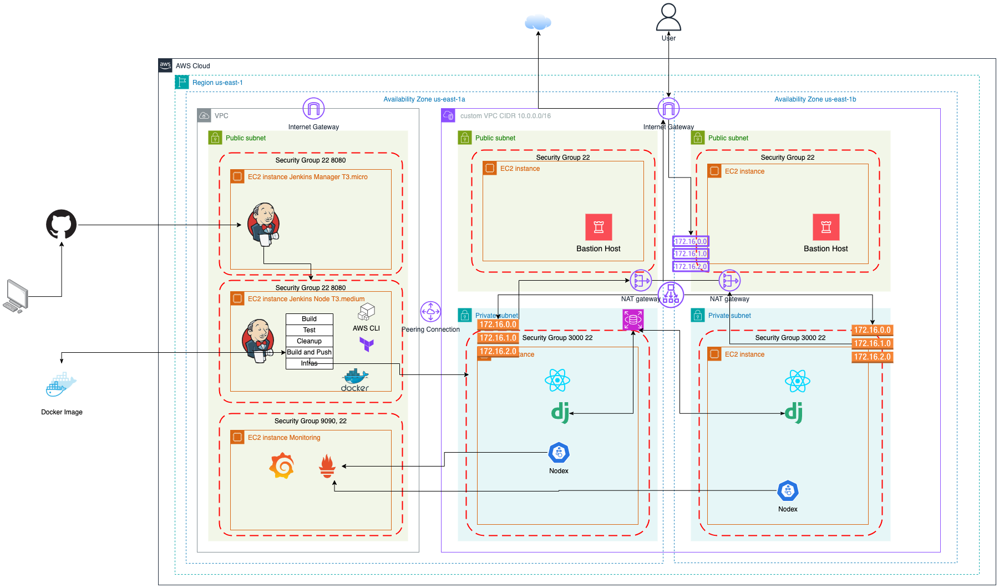

## PURPOSE
The purpose of this workload is to deploy the application to the target production environment using Docker images and Jenkins to implement CI/CD. Workload5 focuses on leveraging Terraform to provision infrastructure across two availability zones, ensuring high availability. However, setting up the frontend and backend environments through scripts introduces challenges for scalability and error reduction. In this workload, Docker is used to simplify the deployment process by creating and managing application images efficiently.

 

  

 

## Steps
### 1. Create Jenkins server  
  * Jenkins: t3.micro
  * Jenkins Node: t3.medium  
    - Unlike previous projects, the pipeline and the actual build, test, and deploy stages will take place on the Jenkins server. However, the Jenkins Node will handle the heavier workload in this project, including building, testing, deploying, and more, so it requires more resources than the manager server.  
    - The benefits of using a node server include:  
    a. Offloading resource-intensive tasks from the manager server.  
    b. Enabling different nodes to perform specific tasks or stages independently.  
    c. Allowing each node to have its own credentials, ensuring higher security for performing their assigned tasks.
    
 
    
    
  
### 2. Create infrastructure using terraform  

  ### VPCs
  In this workload, we used two VPCs, one is default VPC responsible for development, deployment and monitoring. The custom VPC is created to isolate the production environment.   

  * In order for two VPCs communicate using their private IPs, VPC perering connection is needed. 
  * To implement VPC peering, add default VPC to costom VPC's private and public route tables, as well as add costum VPC to default VPC's route table. Finally, we can have four entries on VPC peering:
    
    
  ### Load Balancer
  * The load balancer will forward the HTTP traffic to the web tier. In this step, the load balancer facing the public internet will listen on port 80 and forward traffic to port 3000 on app server. To ensure the security, port 3000 will only open to load balancer security group.
  
  ### Instances
  *   Bastion Host  
    1. It is a gateway allowing secure access from administrators to the instances (frontend and backend) in private subnets.  
    2.  Security Group: Port 22 for SSH  

  * App Server
    1. The app server contains the frontend, backend. In this wordload, no application related resources will be exposed to the public. The developers can only access the apllication server through bastion host.
    2.  Security group: Port 3000 for React, Port 9100 for Node exporter

  * Monitoring server:  
    1. Monitor the app servers using their private IPs, if VPC peering setup properly.
    2. The prometheus targets are two app servers in two AZs.
    3. Security Group: Port 3000 Grafana, Port 9090 Prometheus.

    ### Database  
 * One database reuqired for the data consistency, high effciency.
   1. Set the RDS endpoint. Connect backend to the Rds endpoint. Under multi AZ setup, a standby replica will be created by AWS. Once the primary instance down or AZ level fail occurs, the standby instance will be connected to the database.   
    2. Configure the setting.py in backend server, modify the username and password for the database.  
    

    ### Containerization
    Containerization simplifies the process of setting up environments and installing requirements by isolating the development environment, which further address configuration drift issues.  
    1.  Before automating the process using the CI/CD pipeline, I first created Docker images locally using a Dockerfile which a set of instructions to set up the frontend and backend. A Docker image is a package that contains the required operating system, dependencies, and application code. Developers can use a fixed Docker image to create Docker containers, which can directly run the application.  

    2. Configure the docker-compose.yml file. Docker Compose is a tool used to manage multi-container applications. In this workload, we have two containers: one for the frontend and one for the backend. To orchestrate and configure these containers, we use a docker-compose.yml file. This file defines the images to be used, the environment variables, and the port mappings for each container.
    Run command `docker-compose up` to check if the application can work. Then start the CI/CD pipeline.
    3. Configure the Jenkinsfile to build the pipeline.   
      
    3. Home page by using load balancer's DNS

    
      
   

    4. Monitoring
      
        

  ## ISSUES/TROUBLESHOOTING
  1. terraform configuration: Attributes specification in main module. The resource name consistency is very important. 
  2. Cannot execute scripts in userdata. Check the log in `/var/log/cloud-init-output.log` which contains execution logs of user data and other initialization tasks.
  3. Database endpoint issue: check the setting.py and variables.tf
   

    
  

  4. Pipeline issues
    
    
 A settings_test.py should be setup because the default endpoint have not been create in test stage.

 5. Monitoring Issue
  While check the targets of prometheus, they are down caused by the misconfiguration of my VPC peering. Because of that, two servers in different VPC cannot communication using their private IPs.

  ## OPTIMIZATION  
  * Credentials  
        In this workload, several credentials are needed for creating the infrastructure using Jenkins. It is crucial to keep these credentials secure. I have added them as variables, but there are more secure methods available, such as using AWS Secrets Manager.
  * Scalibility   
    Currently, we have two availability zones to achieve higher availability. The next step is to implement auto-scaling to improve scalability.

  ## CONCLUSION
  In this workload, I've successfully deployed a more efficient application with higher availability using AWS, Docker, Jenkins, and Terraform. Solved challenges in networking, security, and automation improved our understanding of best practices for robust infrastructure management.

  Future optimizations could include migrating to managed container services and further refining CI/CD pipelines to ensure resilience. These steps will make our deployment more efficient, scalable, and secure, laying a strong foundation for production environments.
